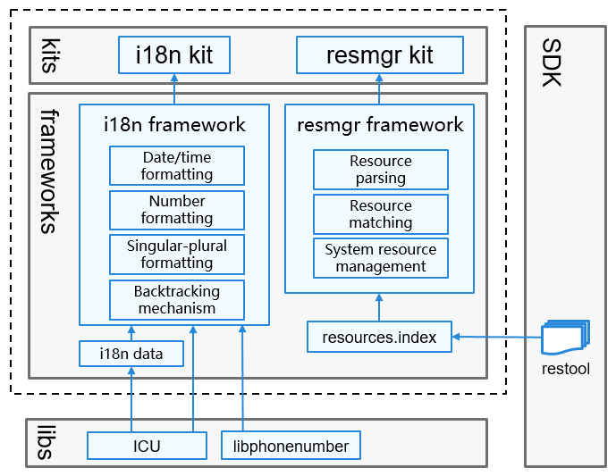

# Globalization Subsystem<a name="ZH-CN_TOPIC_0000001115837954"></a>

## Introduction<a name="section11660541593"></a>

If OpenHarmony systems or applications need to be used globally, they must meet the requirements of users in different regions on languages and cultures. The Globalization subsystem provides the multi-language and multi-cultural capabilities for global use, including:

-   **Resource management**

    The module loads, parses, and initializes system and application resources based on device types and system configurations, and provides APIs for obtaining resources such as character strings and media files.

-   **Internationalization (i18n)**

    The subsystem provides the bottom-layer resource backtracking capabilities, with a wide array of i18n APIs for implementing functions such as date/time formatting, number formatting, phone number formatting, and singular-plural formatting.


## Architecture<a name="section1558604311012"></a>

**Figure 1** Architecture of the globalization subsystem<a name="fig87184592416"></a> 




## Directory Structure<a name="section161941989596"></a>

The source code of the Globalization subsystem is stored in the **/base/global** directory.

```
base/global/global_cangjie_wrapper
├── ohos             # Cangjie Globalization Subsystem code
├── kit              # Cangjie kit code
├── figures          # architecture pictures
```

## Repositories Involved<a name="section1371113476307"></a>

**Globalization subsystem**

global_cangjie_wrapper

[global\_i18n](https://gitee.com/openharmony/global_i18n)
