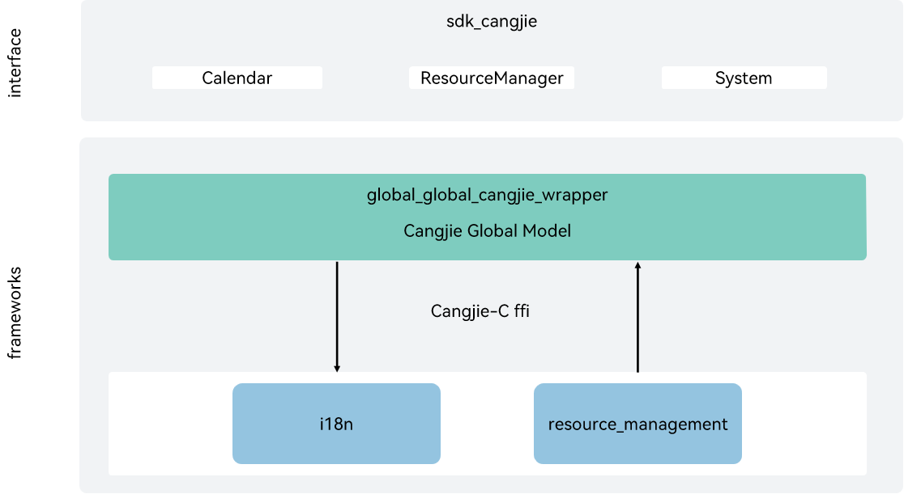

# global_cangjie_wrapper(beta feature)

## Introduction

If OpenHarmony systems or applications need to be used globally, they must meet the requirements of users in different regions on languages and cultures. The Globalization subsystem provides the multi-language and multi-cultural capabilities for global use, including:

-   **Resource management**

    The module loads, parses, and initializes system and application resources based on device types and system configurations, and provides APIs for obtaining resources such as character strings and media files.

-   **Internationalization (i18n)**

    The subsystem provides the bottom-layer resource backtracking capabilities, with a wide array of i18n APIs for implementing functions such as calendar.

The currently open Ability Cangjie api only supports standard devices.

## Architecture

**Figure 1** Architecture of Cangjie Global



As shown in the architecture:

Interface:

- Calendar: Provides the capability to obtain and set calendar properties, such as time, time zone, etc.
- ResourceManager: Provides the capability for application resource acquisition.
- System: Provides the capability to obtain the application's preferred language.

Framework:

- Calendar wrapper: Implementation encapsulation of Cangjie Calendar, providing Calendar capabilities.
- ResourceManager wrapper: Implementation encapsulation of Cangjie ResourceManager, providing ResourceManager capabilities.
- System wrapper: Provides Implementation encapsulation of Cangjie System, providing System capabilities.

- Explanation of Dependencies in the Architecture Diagram:

- i18n: Responsible for providing basic internationalization functions, and encapsulates C Language interfaces for Cangjie to conduct interoperation.
- Resmgr: Responsible for providing basic resource management functions, and encapsulates C Language interfaces for Cangjie to conduct interoperation.
- cangjie_ark_interop: Responsible for providing Cangjie APILevel class definitions, which are used to annotate APIs, as well as providing the definition of BusinessException class that is thrown to users.
- JS UI Framework: responsible for providing FFI interfaces related to Resource, which are used to operate application resources.
- arkui_cangjie_wrapper: Responsible for providing interface definitions such as ResourceColor, which are used to implement the AppResource class.
- hiviewdfx_cangjie_wrapper: Responsible for providing logging interfaces, which are used to print logs at key points in the execution path.

## Directory Structure

```
base/global/global_cangjie_wrapper
├── figures                     # architecture pictures
├── kit                         # Cangjie LocalizationKit kit code
│   └── LocalizationKit
├── ohos                        # Cangjie Global code
│   ├── BUILD.gn
│   ├── i18n
│   │   ├── calendar.cj         # The interface for Calendar
│   │   └── system.cj           # The interface for system configuration
│   └── resource_manager        # The interface for ResourceManager
└── test                        # Cangjie Global test cases
    ├── i18n                    # i18n test cases
    └── resource_manager        # resource_manager test cases
```

## Usage Guidelines

The following features are provided:

- Calendar provides the capability to obtain and set calendar properties, such as time, time zone, etc.
- ResourceManager provides the capability for application resource acquisition.
- System provides the capability to obtain the application's preferred language.

For Global-related APIs, please refer to
1. [Internationalization](https://gitcode.com/openharmony-sig/arkcompiler_cangjie_ark_interop/blob/master/doc/API_Reference/source_en/apis/LocalizationKit/cj-apis-i18n.md)
2. [Resource Management](https://gitcode.com/openharmony-sig/arkcompiler_cangjie_ark_interop/blob/master/doc/API_Reference/source_en/apis/LocalizationKit/cj-apis-resource_manager.md)

For relevant guidance, please refer to [Internationalization Development Guide](https://gitcode.com/openharmony-sig/arkcompiler_cangjie_ark_interop/tree/master/doc/Dev_Guide/source_en/internationalization) and [ResourceManager Development Guide](https://gitcode.com/openharmony-sig/arkcompiler_cangjie_ark_interop/blob/master/doc/Dev_Guide/source_zh_cn/resource-manager/cj-resource-manager.md)

## Constraints

The following features are not provided yet:

- Date formatting, number formatting, and sorting.
- Functions such as region management, phone number processing, text processing, time zone and holiday management.
- Cross-thread transmission of resource objects.

## Code Contribution

Developers are welcome to contribute code, documentation, etc. For specific contribution processes and methods, please refer to [Code Contribution](https://gitcode.com/openharmony/docs/blob/master/en/contribute/code-contribution.md).

## Repositories Involved

[arkcompiler_cangjie_ark_interop](https://gitcode.com/openharmony-sig/arkcompiler_cangjie_ark_interop)

[arkui_ace_engine](https://gitcode.com/openharmony/arkui_ace_engine)

[arkui_arkui_cangjie_wrapper](https://gitcode.com/openharmony-sig/arkui_arkui_cangjie_wrapper)

[global_i18n](https://gitcode.com/openharmony/global_i18n)

[global_resource_management](https://gitcode.com/openharmony/global_resource_management)

[hiviewdfx_hiviewdfx_cangjie_wrapper](https://gitcode.com/openharmony-sig/hiviewdfx_hiviewdfx_cangjie_wrapper)
