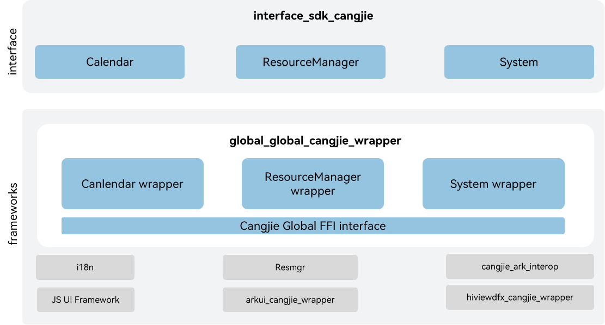

# global_cangjie_wrapper

## Introduction

The global_cangjie_wrapper is a Cangjie API encapsulated on OpenHarmony based on the capabilities of the global Subsystem. If OpenHarmony systems or applications need to be used globally, they must meet the requirements of users in different regions on languages and cultures. The Globalization subsystem provides the multi-language and multi-cultural capabilities for global use, including:

-   **Resource management**

    The module loads, parses, and initializes system and application resources based on device types and system configurations, and provides APIs for obtaining resources such as character strings and media files.

-   **Internationalization (i18n)**

    The subsystem provides the bottom-layer resource backtracking capabilities, with a wide array of i18n APIs for implementing functions such as calendar.


## Architecture

**Figure 1** Architecture of the globalization subsystem




## Directory Structure

```
base/global/global_cangjie_wrapper
├── ohos             # Cangjie Globalization Subsystem code
├── kit              # Cangjie kit code
├── figures          # architecture pictures
```

## Constraints

The currently open Global Cangjie api only supports standard devices.

## Usage Guidelines

The following features are provided:

  - ResourceManager
  - i18n Calendar

The following features are not provided yet:

 - Intl
 - i18n others.

For Global-related APIs, please refer to
1. [ohos.i18n](https://gitcode.com/openharmony-sig/arkcompiler_cangjie_ark_interop/blob/master/doc/API_Reference/source_en/apis/LocalizationKit/cj-apis-i18n.md)
2. [ohos.resource_manager](https://gitcode.com/openharmony-sig/arkcompiler_cangjie_ark_interop/blob/master/doc/API_Reference/source_en/apis/LocalizationKit/cj-apis-resource_manager.md)

For relevant guidance, please refer to [Internationalization Development Guide](https://gitcode.com/openharmony-sig/arkcompiler_cangjie_ark_interop/tree/master/doc/Dev_Guide/source_en/internationalization)

## Repositories Involved

[global_i18n](https://gitee.com/openharmony/global_i18n)

[global_resource_management](https://gitee.com/openharmony/global_resource_management)

## Code Contribution

Developers are welcome to contribute code, documentation, etc. For specific contribution processes and methods, please refer to [Code Contribution](https://gitcode.com/openharmony/docs/blob/master/en/contribute/code-contribution.md).
