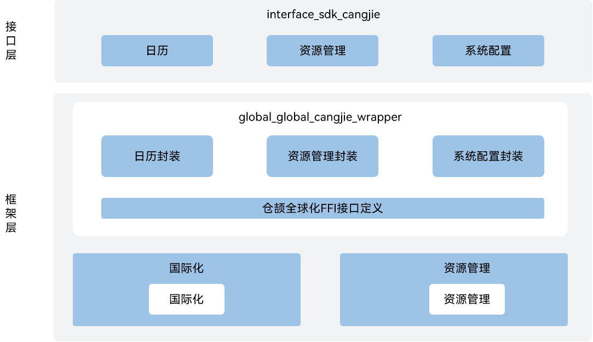

# 全球化仓颉接口

## 简介

全球化仓颉接口是在OpenHarmony上基于全球化子系统能力之上封装的仓颉API。当OpenHarmony系统/应用在全球不同区域使用时，系统/应用需要满足不同市场用户关于语言、文化习俗的需求。全球化仓颉提供支持多语言、多文化的能力，包括：

-   **资源管理能力**

    根据设备类型、系统配置等信息，对应用资源加载、解析和初始化，对外提供获取字符串、媒体等资源的接口。

-   **国际化能力**

    提供底层的资源回溯能力，同时对外提供丰富的国际化接口，包括日历功能等。

当前开放的全球化仓颉接口仅支持standard设备。

## 系统架构

**图 1**  全球化仓颉架构图




如架构图所示：

- 日历：提供获取和设置日历属性的能力，如时间，时区等。
- 资源管理（接口层）：提供应用资源获取的能力。
- 系统配置：提供获取应用偏好语言能力。
- 仓颉全球化FFI接口定义：负责定义C语言互操作仓颉接口，用于实现全球化的能力。
- 国际化：负责提供国际化基础功能，封装C语言接口提供给仓颉进行互操作。
- 资源管理（框架层）：负责提供资源管理基础功能，封装C语言接口提供给仓颉进行互操作。

## 目录

```
base/global/global_cangjie_wrapper
├── figures                 # 存放README中的架构图
├── kit                     # 仓颉LocalizationKit的kit化代码
│   └── LocalizationKit
├── ohos                    # 仓颉全球化接口实现
│   ├── BUILD.gn
│   ├── i18n
│       ├── calendar.cj     # 日历相关接口
│       └── system.cj       # 系统配置相关接口
│   └── resource_manager    # 资源管理相关接口
└── test                    # 仓颉全球化测试用例
```

## 使用说明

全球化仓颉接口提供了以下功能接口，开发者可以根据使用诉求，综合使用一类或多类接口：

  - 日历提供获取和设置日历属性的能力，如时间，时区等。
  - 资源管理提供应用资源获取的能力。
  - 系统配置提供获取应用偏好语言能力。

与ArkTS相比，暂不支持以下功能：

  - 日期格式化、数字格式化、排序。
  - 区域管理、电话号码处理、文本处理、时区和节假日管理等功能。
  - 跨线程传输资源对象。

全球化相关API请参见：
1. [ohos.i18n](https://gitcode.com/openharmony-sig/arkcompiler_cangjie_ark_interop/blob/master/doc/API_Reference/source_zh_cn/apis/LocalizationKit/cj-apis-i18n.md)
2. [ohos.resource_manager](https://gitcode.com/openharmony-sig/arkcompiler_cangjie_ark_interop/blob/master/doc/API_Reference/source_zh_cn/apis/LocalizationKit/cj-apis-resource_manager.md)

相关指导请参见[国际化开发指南](https://gitcode.com/openharmony-sig/arkcompiler_cangjie_ark_interop/tree/master/doc/Dev_Guide/source_zh_cn/internationalization)。

## 参与贡献

欢迎广大开发者贡献代码、文档等，具体的贡献流程和方式请参见[参与贡献](https://gitcode.com/openharmony/docs/blob/master/zh-cn/contribute/%E5%8F%82%E4%B8%8E%E8%B4%A1%E7%8C%AE.md)。

## 相关仓

[arkcompiler_cangjie_ark_interop](https://gitcode.com/openharmony-sig/arkcompiler_cangjie_ark_interop)

[arkui_ace_engine](https://gitcode.com/openharmony/arkui_ace_engine)

[arkui_arkui_cangjie_wrapper](https://gitcode.com/openharmony-sig/arkui_arkui_cangjie_wrapper)

[global_i18n](https://gitcode.com/openharmony/global_i18n)

[global_resource_management](https://gitcode.com/openharmony/global_resource_management)

[hiviewdfx_hiviewdfx_cangjie_wrapper](https://gitcode.com/openharmony-sig/hiviewdfx_hiviewdfx_cangjie_wrapper)
